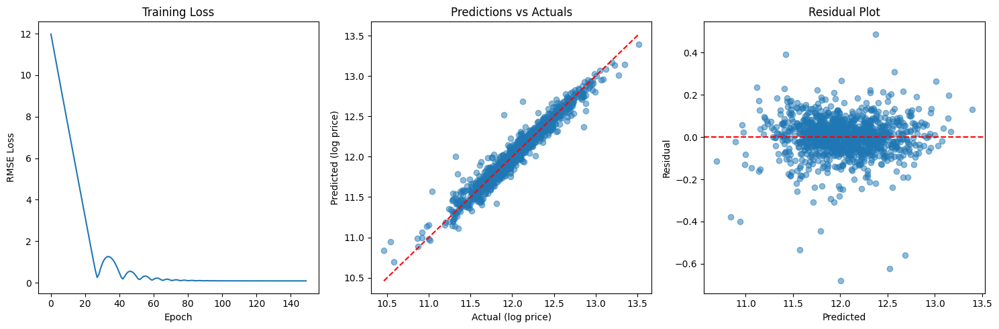
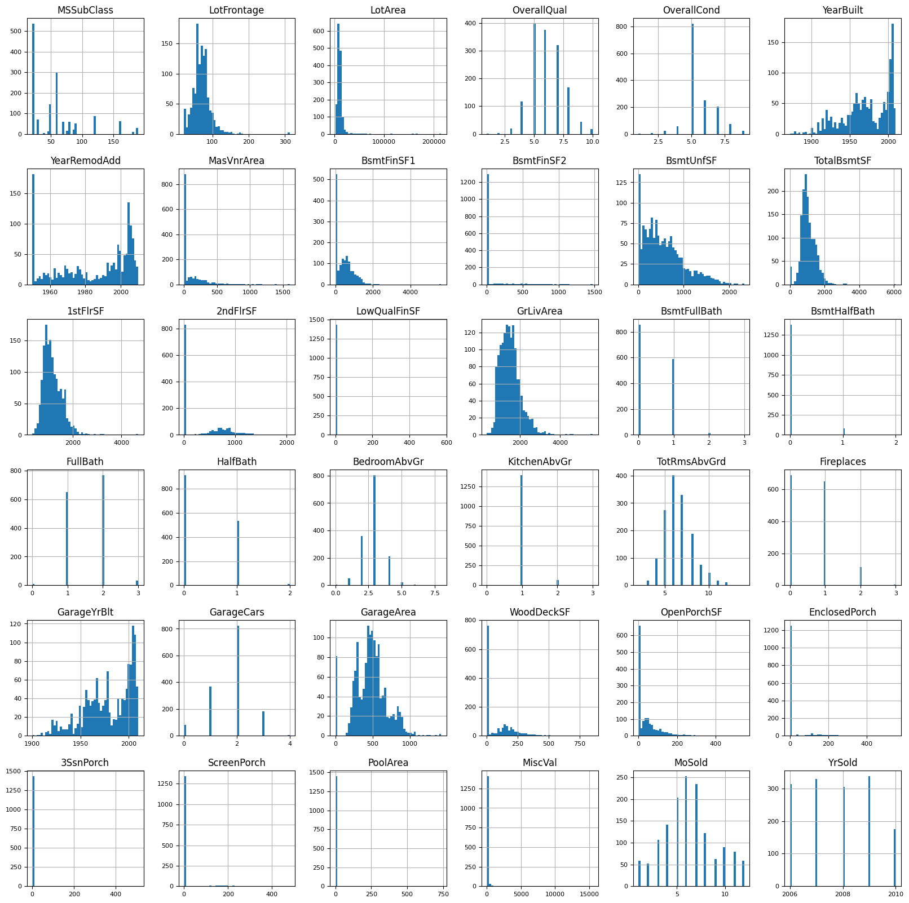
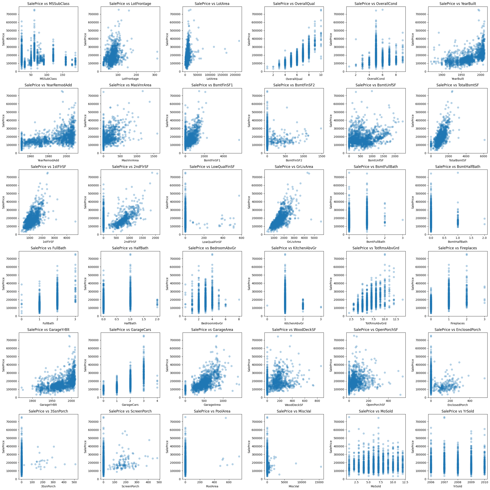
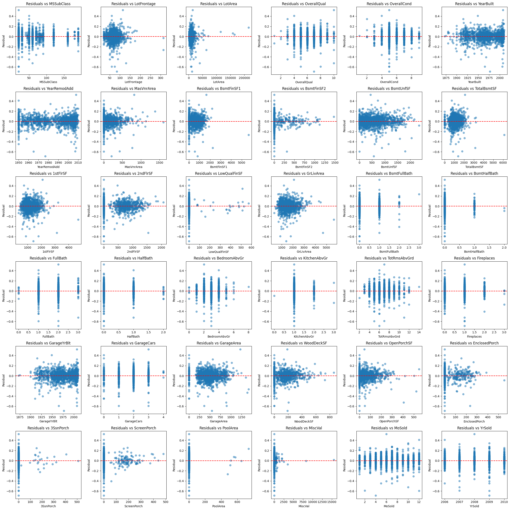

# 🏠 House Price Prediction

Machine learning project for the [Kaggle House Prices - Advanced Regression Techniques](https://www.kaggle.com/competitions/house-prices-advanced-regression-techniques) competition. Predicting residential home sale prices using linear regression with regularization in PyTorch.

*L2 Regularized Model: Training Loss, Predictions vs Actuals, and Residual Plot*

---

## 📑 Table of Contents

- [Author](#-author)
- [Setup](#-setup)
- [Key Findings](#-key-findings)
  - [Model Comparison](#-model-comparison)
  - [Polynomial Feature Investigation](#-polynomial-feature-investigation)
- [Visualizations](#-visualizations)
- [Project Showcase](#-project-showcase)
- [Skills Demonstrated](#-skills-demonstrated)
- [Future Enhancements](#-future-enhancements)

---

## 👤 Author

**Umut Bekdemir**

- GitHub: [@DoubleCyclone](https://github.com/DoubleCyclone)
- LinkedIn: [Umut Bekdemir](https://www.linkedin.com/in/umut-bekdemir-803a2825a)
- Email: [umut.bekdemir29@gmail.com](mailto:umut.bekdemir29@gmail.com)

---

## ⚙️ Setup

1. Download the [dataset](https://www.kaggle.com/competitions/house-prices-advanced-regression-techniques/data) from Kaggle
2. Upload to Google Drive at `/content/drive/My Drive/Colab_Materials/House_Price_Estimation/`
3. See the [full notebook](notebooks/house_price_prediction.ipynb) for the complete analysis

---

## 🔎 Key Findings

- **L2 Regularization (Ridge)** achieved the best generalization with validation RMSE of 0.1289
- **Log-transforming the target** (SalePrice) linearized relationships and optimized for RMSLE
- **PowerTransformer** effectively normalized skewed numerical features
- **Polynomial features** did not improve performance — the log transformation already captured non-linear relationships
- **Proper preprocessing** of test data using training statistics prevents data leakage

### ⭐ Model Comparison

| Model | Train RMSE | Validation RMSE | Overfitting Gap |
|-------|------------|-----------------|-----------------|
| Baseline | 0.0898 | 0.1325 | 0.0427 |
| L1 (Lasso) | 0.0925 | 0.1290 | 0.0365 |
| L2 (Ridge) | 0.0908 | 0.1289 | 0.0381 |

**Winner: L2 Regularized Model** — Best validation performance with controlled overfitting. (L1 wins in the table but these results were at a different runtime which changes outputs a little)

### 📈 Polynomial Feature Investigation

Six features were tested for polynomial terms based on scatter plot and residual analysis:

| Feature | Reasoning | Result |
|---------|-----------|--------|
| OverallQual | Accelerating price pattern at high quality | No improvement |
| YearBuilt | Steeper prices for newer homes | Marginal improvement |
| YearRemodAdd | Similar pattern to YearBuilt | No improvement |
| GrLivArea | Diminishing returns for large homes | No improvement |
| LotArea | Underprediction for large lots | No improvement |
| TotalBsmtSF | Potential non-linear relationship | No improvement |

**Conclusion:** Visual curvature in plots doesn't always translate to model improvement. Empirical testing matters more than intuition.

---

## 📊 Visualizations

### Feature Distributions (Before & After PowerTransformer)

*Numerical feature distributions before transformation — many are heavily skewed*

*After PowerTransformer — features are normalized and centered*

### Feature Analysis

*Scatter plots of SalePrice vs numerical features — used to identify polynomial candidates*

### Residual Analysis

*Residual plots for each feature — checking for non-linear patterns the model missed*

---

## 🎬 Project Showcase

This project demonstrates the complete ML pipeline:

- **Data Preprocessing**: Handled missing values, encoded categoricals, normalized numericals
- **Feature Engineering**: Investigated polynomial features using visual and empirical methods
- **Model Implementation**: Built linear regression from scratch with PyTorch
- **Regularization**: Compared L1 (Lasso) vs L2 (Ridge) regularization
- **Evaluation**: Used train/validation split for fair model comparison
- **Deployment**: Generated predictions for Kaggle submission

---

## 🎓 Skills Demonstrated

**Technical Skills:**
- Python programming
- PyTorch model implementation
- Pandas data manipulation
- Scikit-learn preprocessing (PowerTransformer, OneHotEncoder)
- Data visualization (Matplotlib, Seaborn)
- Regularization techniques (L1, L2)

**Analytical Skills:**
- Residual analysis
- Feature selection methodology
- Model comparison and evaluation
- Avoiding data leakage

**Professional Skills:**
- Documentation and code organization
- Version control (Git/GitHub)
- Kaggle competition participation

---

## 🔮 Future Enhancements

- [ ] Implement k-fold cross-validation for more robust model comparison
- [ ] Experiment with feature interactions (e.g., GrLivArea × OverallQual)
- [ ] Try ensemble methods (Random Forest, Gradient Boosting)
- [ ] Hyperparameter tuning for regularization strength
- [ ] Add feature importance analysis

---

## 📝 Key Learnings

1. **Preprocessing matters** — Proper handling of missing values and feature scaling significantly impacts performance
2. **Log-transform the target** — For RMSLE optimization, `log1p()` linearizes price relationships
3. **Regularization prevents overfitting** — L1/L2 improved validation performance despite higher training loss
4. **Visual analysis informs, empirical testing decides** — Scatter plots suggest candidates; cross-validation confirms
5. **Consistent preprocessing** — Use training statistics when transforming test data to prevent leakage

---

## 📄 License

This project is open source and available under the [MIT License](LICENSE).

## 🙏 Acknowledgments

- [Kaggle](https://www.kaggle.com/) for hosting the competition
- Dean De Cock for compiling the Ames Housing dataset
